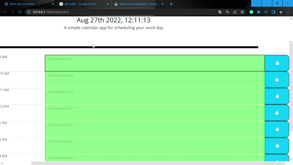

# TaskeronUS

## JAVASCRIPT

- Created a time variable for moment.
- Created a logical loop that examines whether the time is past present or future.
- Created a function that runs when user clicked savebtn. It also sets the current value of text and time to the local storage.
- Created a Bunch of getItem codes to get the item from the local storage.

## USAGE

## LINKS

Github link : https://github.com/ChrisCODES23/daily-tracker

Live link:

## CREDITS

    Coded by Christian Talledo
